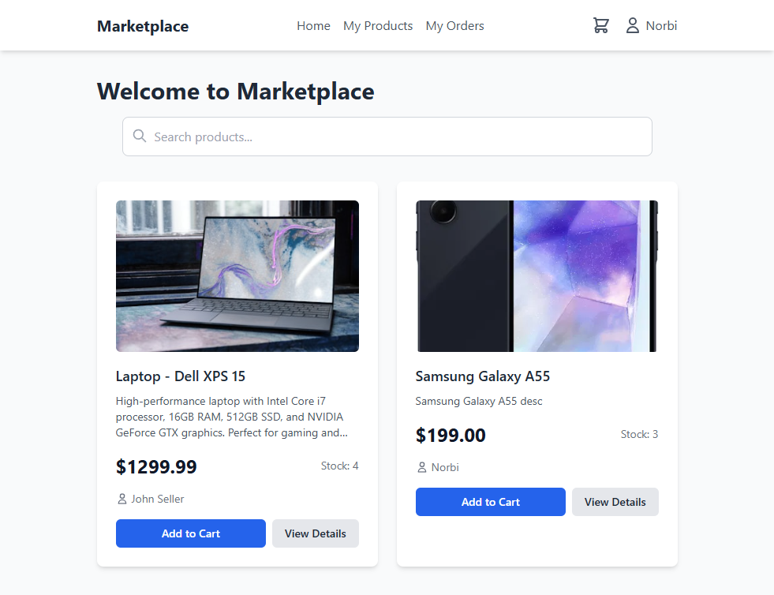
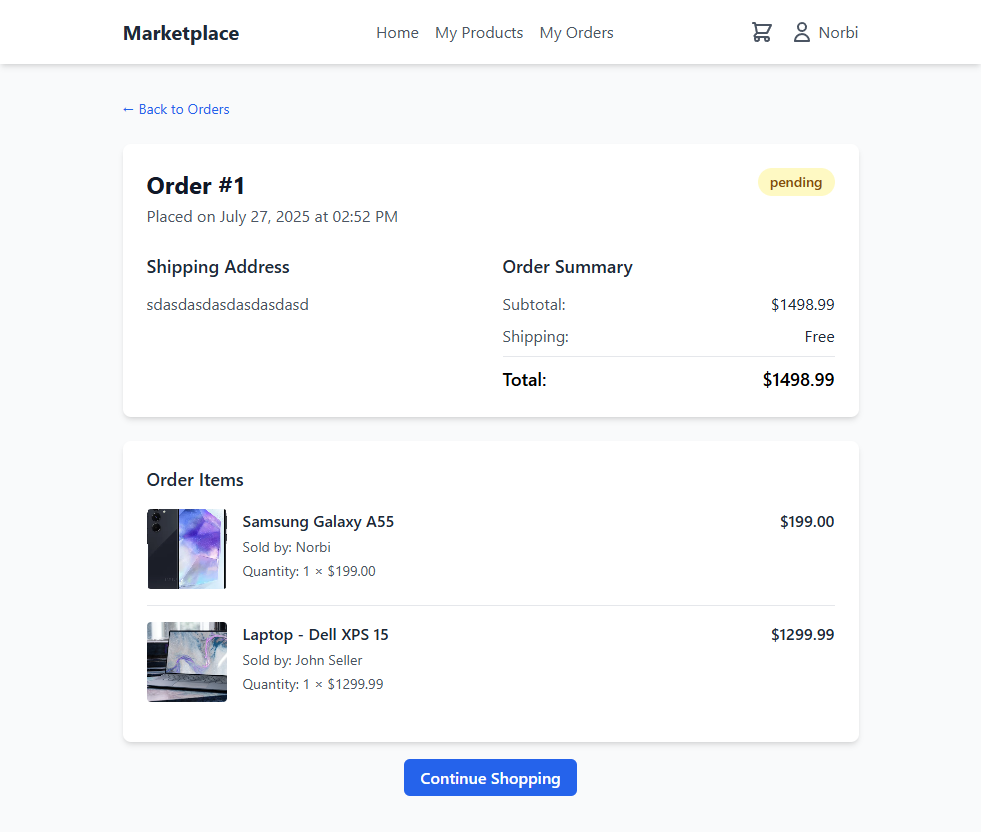
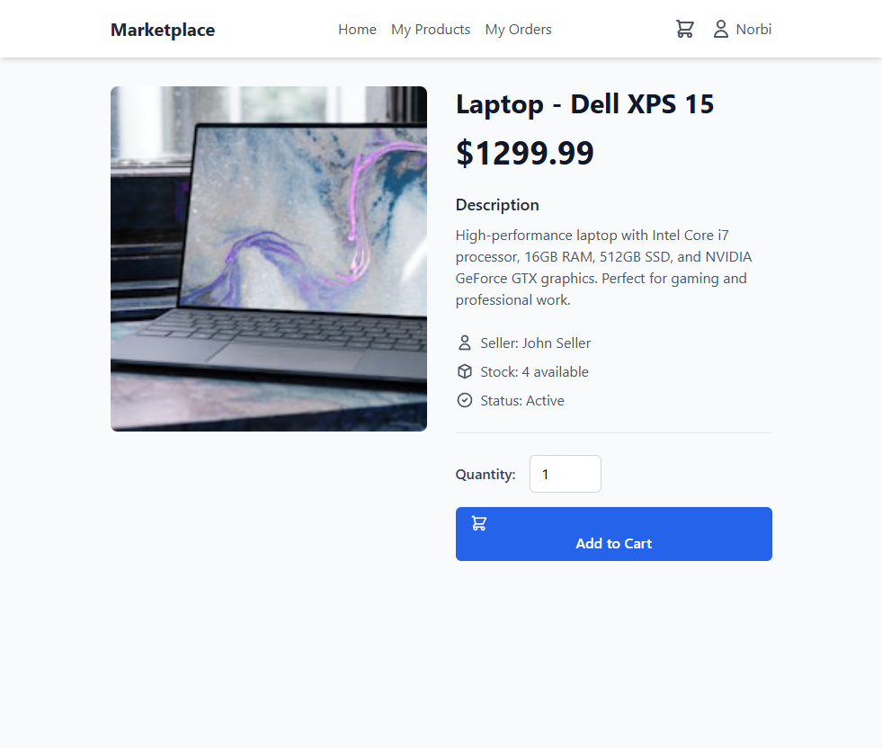

# Marketplace

This project is generated by https://kilocode.ai/

## Prompt & Model

The project is generated with "Claude Opus 4" with prompt 

```
Create a minimal marketplace using MoleculerJS framework on the backend, SQLite for DB and Vuejs and TailwindCSS on the frontend.
```

It took ~30 minutes and cost was $32.

After that, I made [small fixes](https://github.com/icebob/kilo-code-demo-marketplace/commit/e5fa768c8d365da3c3332867386ecf37ac6dd2d1) in parameter validation.


## Result





