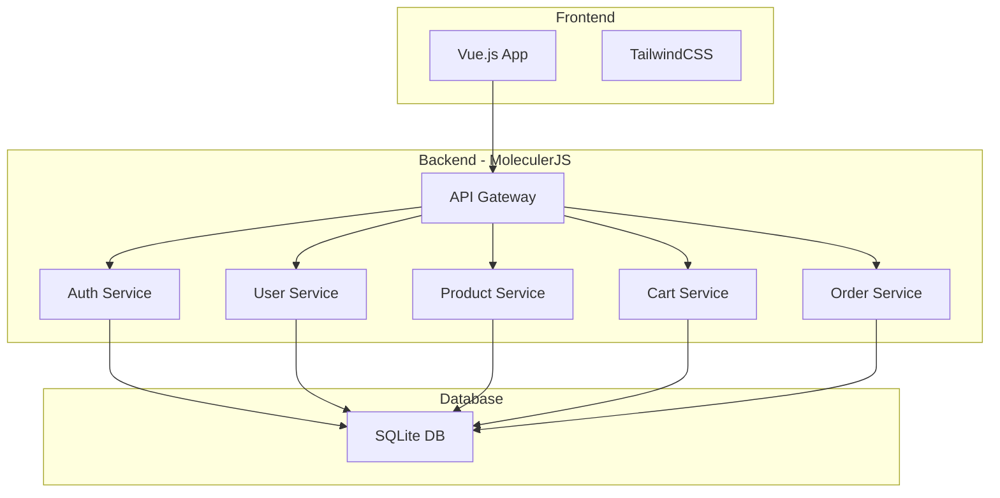

# Minimal Marketplace Architecture Plan

## Overview
A minimal marketplace application built with MoleculerJS microservices on the backend, SQLite database, and Vue.js + TailwindCSS on the frontend.

## System Architecture

## Database Schema

### Users Table
- id (INTEGER, PRIMARY KEY)
- email (TEXT, UNIQUE)
- password (TEXT, hashed)
- name (TEXT)
- role (TEXT, default: 'user')
- created_at (DATETIME)
- updated_at (DATETIME)

### Products Table
- id (INTEGER, PRIMARY KEY)
- seller_id (INTEGER, FOREIGN KEY -> users.id)
- title (TEXT)
- description (TEXT)
- price (DECIMAL)
- quantity (INTEGER)
- image_url (TEXT)
- status (TEXT, default: 'active')
- created_at (DATETIME)
- updated_at (DATETIME)

### Cart Items Table
- id (INTEGER, PRIMARY KEY)
- user_id (INTEGER, FOREIGN KEY -> users.id)
- product_id (INTEGER, FOREIGN KEY -> products.id)
- quantity (INTEGER)
- created_at (DATETIME)
- updated_at (DATETIME)

### Orders Table
- id (INTEGER, PRIMARY KEY)
- buyer_id (INTEGER, FOREIGN KEY -> users.id)
- total_amount (DECIMAL)
- status (TEXT, default: 'pending')
- shipping_address (TEXT)
- created_at (DATETIME)
- updated_at (DATETIME)

### Order Items Table
- id (INTEGER, PRIMARY KEY)
- order_id (INTEGER, FOREIGN KEY -> orders.id)
- product_id (INTEGER, FOREIGN KEY -> products.id)
- seller_id (INTEGER, FOREIGN KEY -> users.id)
- quantity (INTEGER)
- price (DECIMAL)
- created_at (DATETIME)

## Microservices Breakdown

### 1. API Gateway Service
- Routes all frontend requests to appropriate services
- Handles CORS
- Rate limiting
- Request/Response transformation

### 2. Auth Service
- User registration
- User login
- JWT token generation and validation
- Password hashing (bcrypt)

### 3. User Service
- Get user profile
- Update user profile
- Get user's products (as seller)
- Get user's orders (as buyer)

### 4. Product Service
- Create product (seller)
- Update product (seller)
- Delete product (seller)
- List all products
- Get product by ID
- Search products
- Filter by seller

### 5. Cart Service
- Add item to cart
- Update cart item quantity
- Remove item from cart
- Get cart items
- Clear cart

### 6. Order Service
- Create order from cart
- Get order details
- List user orders
- Update order status (for future enhancement)

## Frontend Structure

### Pages
1. **Home** - Product listings with search
2. **Login/Register** - Authentication forms
3. **Product Detail** - Individual product view
4. **Seller Dashboard** - Manage products
5. **Cart** - View and manage cart items
6. **Checkout** - Order placement
7. **My Orders** - Order history

### Components
- Navbar (with cart icon and user menu)
- ProductCard
- ProductForm (for create/edit)
- CartItem
- OrderSummary
- SearchBar
- UserMenu

## API Endpoints

### Authentication
- POST /api/auth/register
- POST /api/auth/login
- GET /api/auth/verify

### Users
- GET /api/users/profile
- PUT /api/users/profile

### Products
- GET /api/products
- GET /api/products/:id
- POST /api/products (seller only)
- PUT /api/products/:id (seller only)
- DELETE /api/products/:id (seller only)
- GET /api/products/seller/:userId

### Cart
- GET /api/cart
- POST /api/cart/items
- PUT /api/cart/items/:id
- DELETE /api/cart/items/:id
- DELETE /api/cart/clear

### Orders
- POST /api/orders
- GET /api/orders
- GET /api/orders/:id

## Security Considerations
- JWT tokens for authentication
- Password hashing with bcrypt
- Input validation on all endpoints
- SQL injection prevention through ORM
- CORS configuration
- Rate limiting on API gateway

## Technology Stack Details

### Backend
- **MoleculerJS**: Microservices framework
- **Sequelize**: ORM for SQLite
- **Express**: For API Gateway
- **jsonwebtoken**: JWT implementation
- **bcrypt**: Password hashing
- **cors**: CORS middleware
- **dotenv**: Environment variables

### Frontend
- **Vue 3**: Composition API
- **Vue Router**: Client-side routing
- **Pinia**: State management
- **Axios**: HTTP client
- **TailwindCSS**: Utility-first CSS
- **Vite**: Build tool
- **Vue Toastification**: Notifications

## Development Workflow
1. Start with backend services setup
2. Implement database models
3. Create basic CRUD operations
4. Add authentication layer
5. Build frontend structure
6. Implement UI components
7. Connect frontend to backend
8. Add error handling
9. Test complete user flows